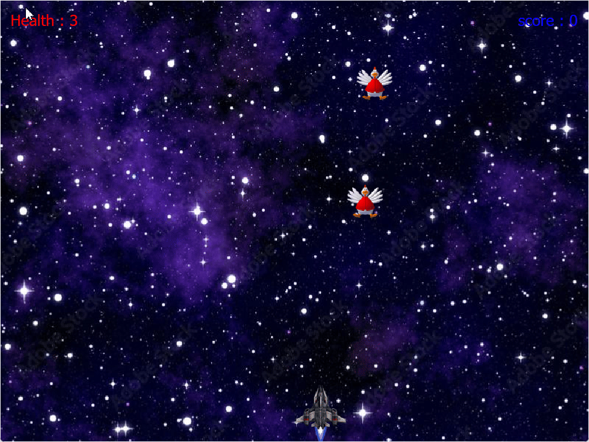
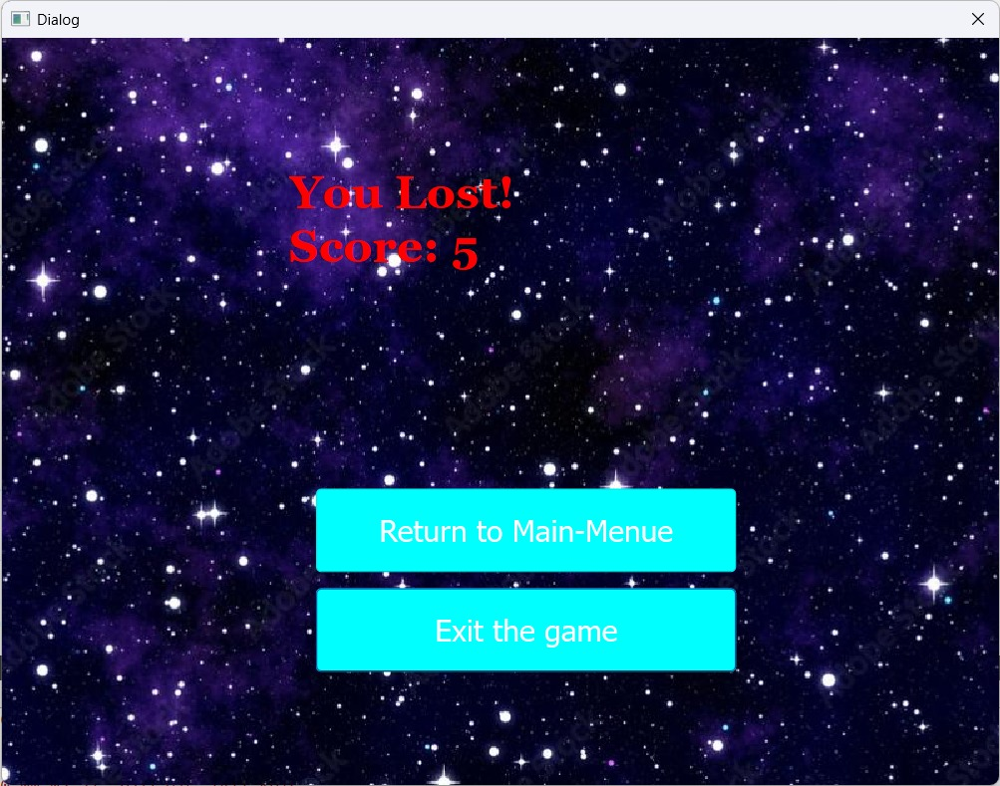

# 🚀 2D Space Shooter Game (Qt + C++)

**Project Type:** Arcade Game  
**Technologies Used:** C++, Qt (QtWidgets + QtMultimedia)

---

## 🎮 Overview

This is a classic 2D space shooter game where the player controls a spaceship, shoots enemies, and tries to survive as long as possible. It includes sound effects, scoring, health tracking, and a game over notification—all within a clean Qt GUI.

---

## ✨ Features

* 🧍‍♂️ **Player Movement and Shooting**

  * Use arrow keys to move left/right.
  * Press space bar to shoot bullets.

* 👾 **Enemies**

  * Spawn randomly from the top.
  * Move downward and reduce health on contact with the bottom of the screen.

* 💥 **Collision Detection**

  * Bullets destroy enemies upon collision.
  * Score increases with each enemy hit.

* 🧡 **Health System**

  * Player starts with 3 health points.
  * Health decreases if enemies reach the bottom.
  * Game over when health reaches zero.

* 🔊 **Sound Effects**

  * Background music.
  * Shooting and explosion sounds.
  * Game over alert.

* 🪪 **Game Over Handling**

  * Displays final score in a styled lose window.
  * Prevents repeated messages using a flag.

---

## 🗂️ Project Structure

| File             | Description                                                    |
| ---------------- | -------------------------------------------------------------- |
| `main.cpp`       | Entry point; sets up main application window.                  |
| `mainwindow.cpp` | Manages main menu, navigation, and launching the game window. |
| `game.cpp`       | Contains core gameplay logic, scene, and QGraphicsView setup.  |
| `player.cpp`     | Handles player input and shooting mechanics.                   |
| `bullet.cpp`     | Manages bullet movement and collision detection.               |
| `enemy.cpp`      | Controls enemy behavior, movement, and game-over logic.        |
| `score.cpp`      | Tracks and displays player's score.                            |
| `health.cpp`     | Tracks and displays player's health.                           |
| `losewindow.*`   | Custom dialog showing stylish game over message with final score.|

---

## 🖼️ Screenshots & Demo

### Gameplay Demo GIF  

### Lose Window with Final Score  

---

## 🖥️ How to Run

### 🧭 Open Project Using Qt

1. Open **Qt Creator**.
2. Go to **File > Open File or Project**.
3. Select the `.pro` file in the project directory.
4. Configure the kit if prompted.
5. Press **Run** to build and launch the application.
6. Use the **Main Window** to start the game, access menus, or exit.

> 💡 The **Main Window** acts as the launcher, and the **Game** class handles the gameplay inside the game view.

---

## 🕹️ Controls

| Action      | Key       |
| ----------- | --------- |
| Move Left   | ← (Left)  |
| Move Right  | → (Right) |
| Fire Bullet | Space Bar |

---

## 🖼️ Assets

* Player ship: `:/Images/ship.png`
* Enemy: `:/Images/enemy.jpeg`
* Bullet: `:/Images/red_laser.png`
* Sounds:
  * Shooting: `:/Aud/bulletshot.wav`
  * Explosion: `:/Aud/destruction.m4a`
  * Background Music: `:/Aud/bgsound.mp3`
  * Game Over: `:/Aud/GameOver.wav`

---

## 👥 Contributors

* **Yousef Elmenshawy**  
* [**Koussay Jaballah**](https://github.com/koussay0/koussay0.git)

---

## 📬 Contact & Contributions

If you have any questions or suggestions, feel free to reach out at **[yousefelmenshawi@aucegypt.edu](mailto:yousefelmenshawi@aucegypt.edu)**.

🎉 **Contributions are welcome!** If you'd like to improve or extend the project, feel free to open a pull request.

---

